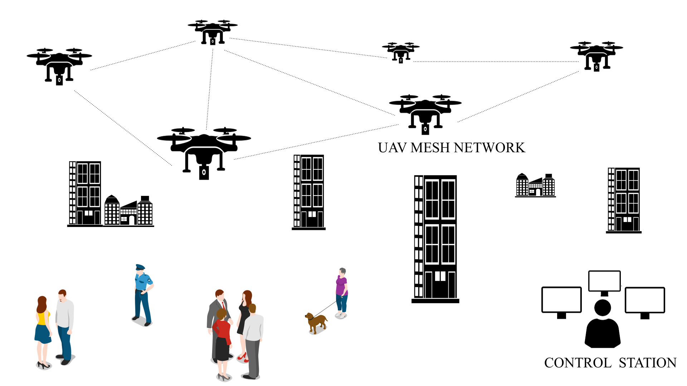
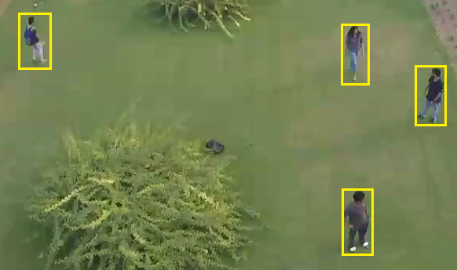
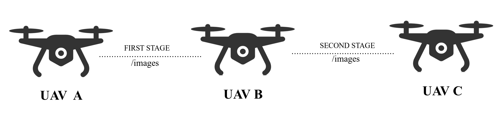

# UAV-based-Person-Re-Identification-and-Dynamic-Image-Routing-using-WMNs
### Authors: Neelabhro Roy & Sauranil Debarshi
### Abstract:
Person Re-Identification (PRID) has been one of the most challenging tasks in intelligent video surveillance. Most existing PRID based surveillance methods rely on a single camera mounted on emplacements. This approach assumes that any scrutinized person appears again in the field of view of that cam-era, which is unreliable in real-world settings. In this paper, we propose a system wherein we explore on-board re-identification of persons using cameras mounted on Unmanned Aerial Vehicles (UAVs). The captured images are dynamically shared between multiple UAVs by virtue of wireless mesh networking, also making use of the Robot Operating System (ROS) for on-ground control of the UAVs from a control station, facilitating the exchange of images between them. We demonstrate our approach on an institutional dataset we created, and our experimental results show that the system could be indispensable in aiding airborne surveillance operations.

#### Wireless mesh network consisting of UAVs and a base station:

#### Experimental setting for building dataset:

#### Illustration of our experimental setup:

The work was presented at the IEEE International Conference on Signal Processing and Integrated Networks (SPIN) 2020. 
Please cite [1] if you choose to use this work. The work can be found at IEEE Xplore(https://ieeexplore.ieee.org/document/9071078)

### Reference:
[1] N. Roy and S. Debarshi, "UAV-based Person Re-Identification and Dynamic Image Routing using Wireless Mesh Networking," 2020 7th International Conference on Signal Processing and Integrated Networks (SPIN), Noida, India, 2020, pp. 914-917, doi: 10.1109/SPIN48934.2020.9071078.
